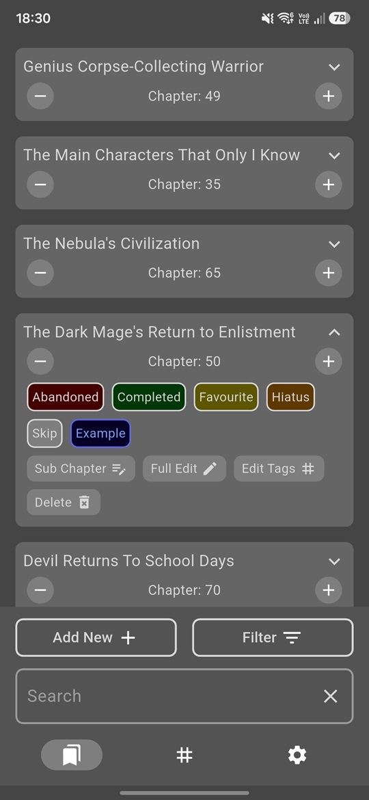
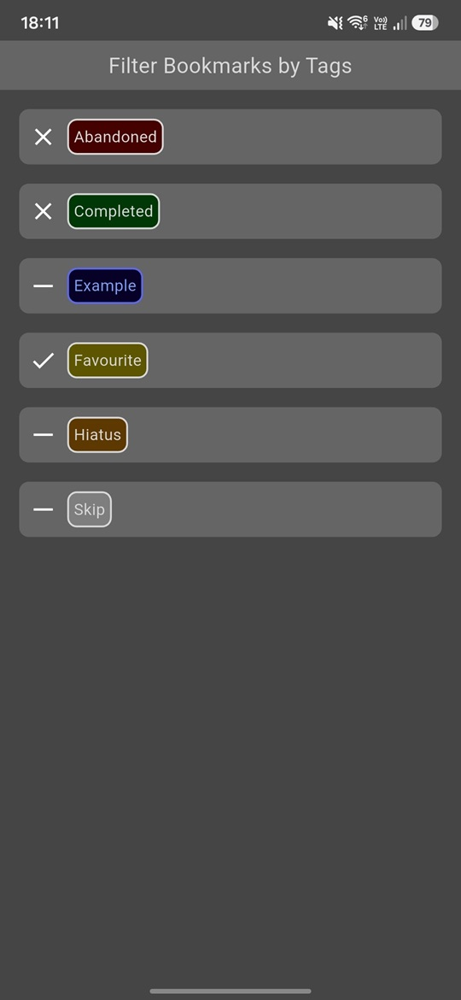
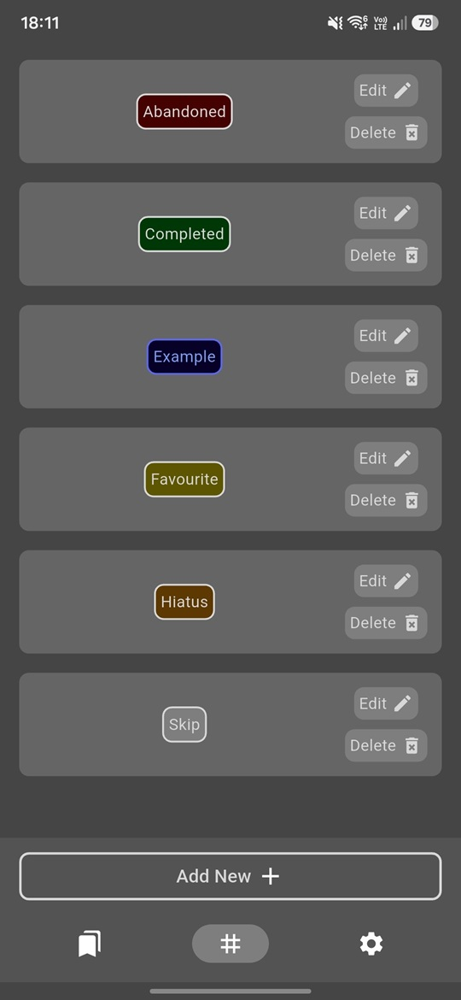
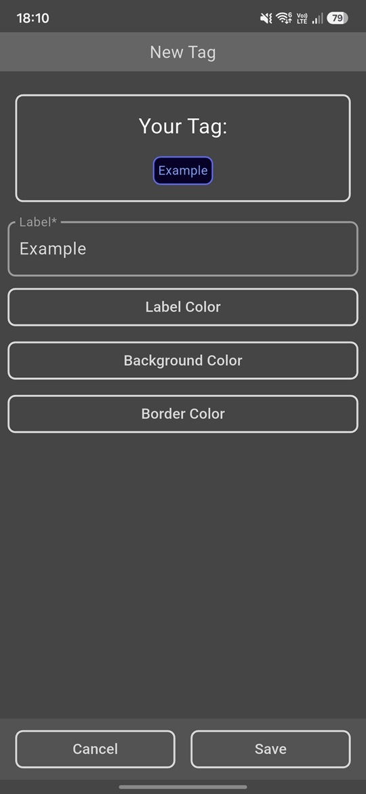
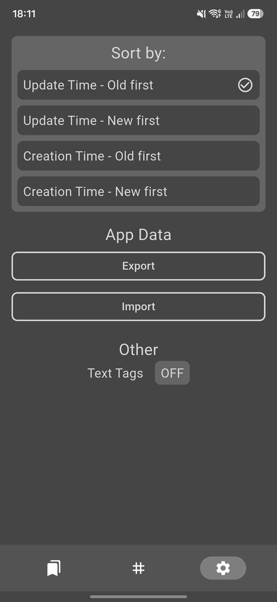

# Bookmark Manager

An Android app for keeping track of where you left off in the things you read, like web novels, manga or books. A bookmark is a title and a chapter number you bump as you go, organised with your own colour-coded tags.

Fully offline: no account, no sync, and the release build doesn't declare the internet permission at all. Your data stays on the device, and you move it to another phone with a JSON export.

*Android only. Built with Flutter.*

## Screenshots

| Bookmarks | Filtering by tags | Tags |
|:---:|:---:|:---:|
|  |  |  |

| New tag | Settings |
|:---:|:---:|
|  |  |

## Bookmarks

- The list shows every bookmark with its current chapter, in whichever order you picked in settings
- `−` and `+` on a tile change the chapter straight from the list, without opening anything
- Tapping a tile expands it to show its tags and the buttons for editing the sub chapter, the tags or the whole bookmark, and for deleting it
- A *sub chapter* is a free-text suffix on the number, so chapter `12` can become `12.5` or `12a`
- A search bar narrows the list by title; the Filter screen narrows it by tag
- Four sort orders: creation time or last update, oldest or newest first

## Tags

- Every tag has a label and three colours of its own: text, background and border
- The editor previews the tag as you customize it, so you see the result before saving
- All tags sit on one screen, where you can edit or delete them later
- Filtering is three-state per tag: ignore it, show only bookmarks with it, or hide every bookmark with it

## Settings

- The selected sorting order option is remembered between sessions
- Export writes every bookmark, tag and setting to a timestamped JSON file in the device's `Download` folder
- Import reads such a file back, replacing what's currently on the device
- Text Tags drops the custom background and border, leaving just the coloured label

## Running it

Requires Flutter 3.32.5 (Dart SDK 3.8+).

```bash
flutter pub get
flutter run
```

## Status

A personal project. I still use it daily; it does what I need, so it's not actively developed anymore.

## License

GPL-3.0 - see [LICENSE](LICENSE).
